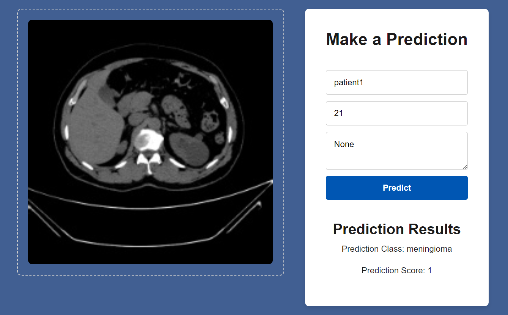
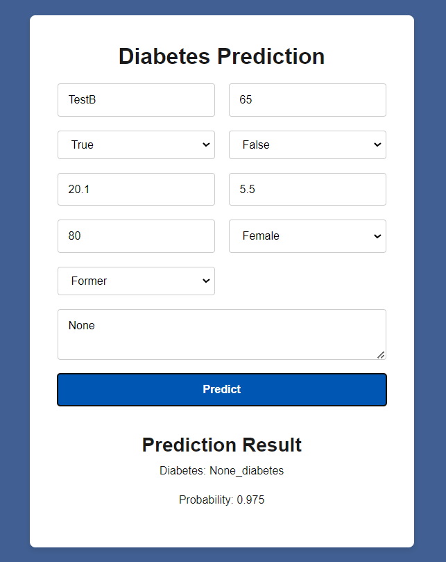
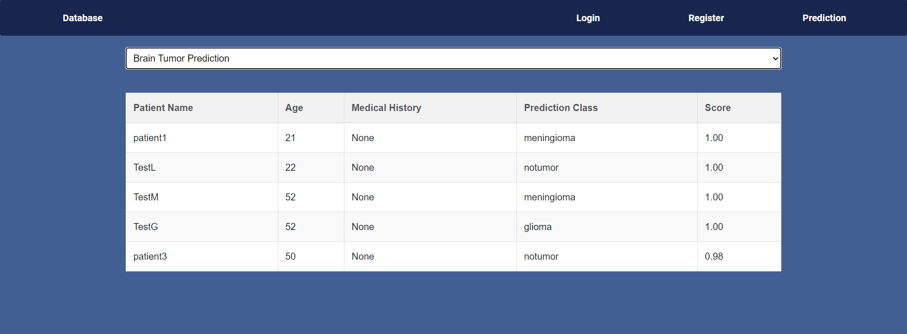

# Intregrated_ML_to_webapp

" This project demonstrate web application of how we integrate machine learning model into web application using django and react. After develop machine learning model , we want to deploy the model into the web application for tasking like classification or prediction. Create Django and Django REST Framework endpoints to handle API requests. The endpoint will then recieve the necessary feature for machine learning model to predict or classify from the server frontend. It's important to know that before directly passing all the feature or image into the model, we have to preprocess them first. After preprocess and pass to the model , it eventually give the output and response back to the frontend server."

## Features

- Image Classification
- Diabetes Prediction
- API Integration with Django and Django REST Framework
- React Frontend
- linking django with sqlserver

## Setup Instructions

- **Conda**: installed on your machine

### 1. Clone the Repository

First, clone the repository to your local machine:

```bash
git clone https://github.com/yourusername/Intregrated_ML_to_webapp.git
cd Intregrated_ML_to_webapp
```

### 2. Create and activate conda environment using environment.yml (This provided all library using in this project)

```bash
conda env create -f environment.yml
conda activate fullstack  # Double check the name in environment.yml

```

### 3. Manually create Image_files folder to store image

BACKEND\Image_files

### 4. Create a .env file This hold all important parameter that should be keep as secret (eg. database parameter , secret key) BACKEND/.env

```bash
Inside .env file

DEBUG=True
SECRET_KEY=your-secret-key
DB_NAME=your_database_name
DB_USER=root
DB_PASSWORD=your_database_password
DB_HOST=127.0.0.1
DB_PORT=3306
```

### 4. Apply Database Migrations ( cd BACKEND/)

```bash
python manage.py makemigrations
python manage.py migrate
```

### 5. Create a Superuser ( cd BACKEND/)

```bash
python manage.py createsuperuser
```

### 6. Run the Development Server

```bash
python manage.py runserver
```

## Frontend Setup Instructions

1. **Navigate to the Frontend Directory**

   ```bash
   cd frontend
   ```

2. **Install Node.js and npm**

   link to download ->>>> [official Node.js website](https://nodejs.org/).

   To check if you have Node.js and npm installed

   ```bash
   node -v
   npm -v
   ```

3. **Install Dependencies**

   Install the necessary dependencies for the React project:

   ```bash
   npm install
   ```

4. **Set Up Environment Variables**

   Create a `.env` file in the `frontend` directory:

   ```env
   REACT_APP_API_URL=http://localhost:8000/api
   ```

5. **Start the Development Server**

   Start the React development server:

   ```bash
   npm start
   ```

### Local Image




